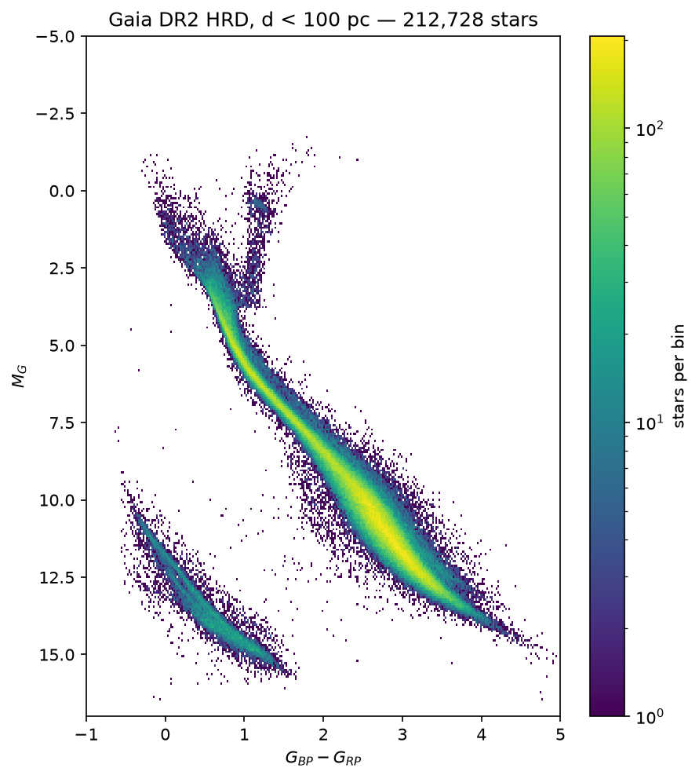
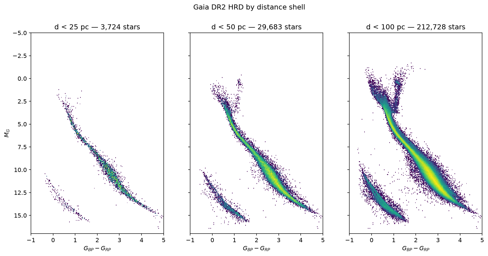

# gaia-mcp-server

An MCP server that exposes science tools — the Gaia DR2 colour–magnitude
diagram of the solar neighbourhood — to any LLM agent. Built on the same
pattern as [`spectra-mcp-server`](https://github.com/HEP-KE/spectra-mcp-server);
the multi-agent client in
[`multiagent-client-demo`](https://github.com/HEP-KE/multiagent-client-demo)
drives either server unchanged.

## The science

Gaia's central achievement is a trigonometric distance scale for over a
billion stars. Distances turn an observed colour–magnitude diagram into a
physical Hertzsprung–Russell diagram, in which stellar evolution can be read
directly. The tools here reproduce the observational HRD of the stars within
100 pc — **Fig. 5c of Gaia Collaboration, Babusiaux et al. (2018), A&A 616,
A10 ([arXiv:1804.09378](https://arxiv.org/abs/1804.09378)): 212,728 stars** —
with the paper's own quality selection. The main sequence, the binary
sequence, the red clump, and the white dwarf sequence are all identifiable in
the result.

## The one idea this repo teaches

> **The science code stays in usual Python. The MCP wrapper only publishes it.**

- `tools/` is an ordinary science package. It never imports MCP.
- `mcp_server/` is a ~70-line generic wrapper. It reads one line of config from
  `pyproject.toml`, imports the science package, and registers every function
  listed in its `__all__` as an MCP tool.

```toml
[tool.mcp-server]
tool_modules = ["tools"]
```

## Layout

```
data/gaia_dr2_100pc.csv.gz        bundled snapshot of the 100 pc query (offline fallback)
tools/
  gaia.py                         ADQL query, bundled loader, Babusiaux+ 2018 quality cuts
  cmd_tools.py                    the 4 tool functions + ArtifactResult contract
  __init__.py                     __all__ — ONLY these names become tools
mcp_server/                       generic drop-in wrapper (FastMCP)
notebooks/01_manual_pipeline.ipynb  a walkthrough: data → cuts → HRD → tools → server
tests/test_tools.py               tools tested as plain Python, no MCP or network needed
```

## Tools

| tool | what it does |
|---|---|
| `fetch_gaia_sample(output_dir, ...)` | ADQL query of `gaiadr2.gaia_source` (parallax ≥ 10 mas, SNR > 10); falls back to the bundled snapshot offline |
| `apply_quality_filters(input_file, output_dir, ...)` | the Babusiaux+ 2018 photometric + astrometric cuts, with per-filter counts and justifications |
| `compute_absolute_magnitudes(input_file, output_dir)` | M_G = G + 5 log₁₀(ϖ/mas) − 10 |
| `plot_cmd(input_file, output_dir, ...)` | log-density HRD, axes matched to the published Fig. 5c |
| `compare_distance_shells(input_file, output_dir, ...)` | side-by-side HRDs within 25/50/100 pc — the full published Fig. 5 |
| `plot_kinematics_cmd(input_file, output_dir, ...)` | velocity-sliced HRDs + mean-v_T map (Fig. 7) |
| `plot_variable_stars_cmd(input_file, output_dir)` | DR2-flagged variables on the HRD (Fig. 15) |
| `plot_infrared_cmd(input_file, output_dir)` | the 2MASS infrared HRD (Fig. 6) |
| `plot_sky_map(input_file, output_dir)` | the sample in galactic coordinates — Hyades + scanning-law holes |

### The query

`fetch_gaia_sample` runs exactly this ADQL against the
[ESA Gaia archive](https://gea.esac.esa.int/archive/) (asynchronous job —
synchronous queries time out on full-table scans), and returns the query
string in `metadata["adql"]` so an agent can show its work:

```sql
SELECT g.source_id, g.l, g.b, g.parallax, g.parallax_over_error,
       g.phot_g_mean_mag, g.bp_rp, g.phot_bp_rp_excess_factor,
       g.phot_g_mean_flux_over_error, g.phot_bp_mean_flux_over_error,
       g.phot_rp_mean_flux_over_error, g.visibility_periods_used,
       g.astrometric_chi2_al, g.astrometric_n_good_obs_al,
       g.pmra, g.pmdec, g.radial_velocity, g.phot_variable_flag,
       tm.j_m, tm.ks_m
FROM gaiadr2.gaia_source AS g
LEFT OUTER JOIN gaiadr2.tmass_best_neighbour AS bn ON g.source_id = bn.source_id
LEFT OUTER JOIN gaiadr1.tmass_original_valid AS tm ON bn.tmass_oid = tm.tmass_oid
WHERE g.parallax >= 10 AND g.parallax_over_error > 10
```

The two `LEFT JOIN`s attach 2MASS infrared photometry **server-side** (NaN
where unmatched); `phot_variable_flag` is recoded at fetch time into a
numeric 1/0 column named `variable`, so every column in the pipeline stays
numeric. Note what is **not** there: no `SELECT TOP N` — a truncated result
is not a random sample (use Gaia's `random_index` column if you ever need
one). The query returns 439,020 rows (~13 min);
`data/gaia_dr2_100pc.csv.gz` (~33 MB) is a snapshot of exactly this result
(fetched August 2026), which is what the bundled fallback and the offline
tests use.

### The result

The pipeline output with the default (paper) settings — **212,728 stars**,
matching the published Fig. 5c count exactly:



And `compare_distance_shells`, reproducing the full Fig. 5:



Two conventions worth copying into any science MCP server:

1. Every tool returns `{status, files, message, metadata}` (`ArtifactResult`).
2. Arrays move between tools **as file paths**, never through the agent's
   context window.

### Traps this pipeline is built to avoid

- **`d = 1/parallax` is not safe in general** — it is biased for noisy
  parallaxes and meaningless for negative ones. It is acceptable here only
  because the sample demands parallax SNR > 10.
- **A parallax-SNR cut biases the sample**: it preferentially removes faint
  red stars, not a random subset.
- **`SELECT TOP N` is not a random sample.** The fetch downloads all matching
  rows; use Gaia's `random_index` column when you truly need a subsample.
- **Skipping `ruwe`/excess-factor style cuts** leaves a spurious plume of
  blended sources crossing the diagram. DR2 predates the RUWE column; the
  unit-weight-error cut used here is its published precursor.

## Install

```bash
conda create -n gaia-tutorial python=3.12 -y
conda activate gaia-tutorial
pip install -e ".[dev]"
pytest
```

Already have the `spectra-tutorial` env from the other server? You can reuse
it: `pip install astroquery`, then always launch this server (and pytest)
**from this repo's root directory** — both tutorial servers export packages
named `tools` and `mcp_server`, so don't `pip install -e` both into one env;
running from the repo root makes the local packages win.

## Run the server

**Streamable HTTP** — the server is a visible process with a URL:

```bash
python -m mcp_server --transport streamable-http --port 8000
```

Clients connect to `http://127.0.0.1:8000/mcp`. Stop the server with
**Ctrl+C** (Ctrl+Z only suspends it, leaving the port taken — if that
happens, just start the server again: it detects a leftover `mcp_server`
holding the port and clears it automatically).

## Start with the notebook

`notebooks/01_manual_pipeline.ipynb` builds everything up in order: the
query, the quality cuts one at a time (with star counts), the HRD, the same
steps as tools, then the server. Committed outputs let you read it without
running anything.

Its **appendix** goes further with
[`jobovy/gaia_tools`](https://github.com/jobovy/gaia_tools) (archived
January 2025, still works; `pip install
git+https://github.com/jobovy/gaia_tools`): one cached extended query adds
kinematics, the variability flag, and a server-side 2MASS cross-match, and
from it the velocity-sliced HRDs of the paper's Fig. 7, the mean-$v_T$ map,
the variable stars of Fig. 15, the infrared HRD of Fig. 6, and the 100 pc
sky map with the Hyades standing out.
